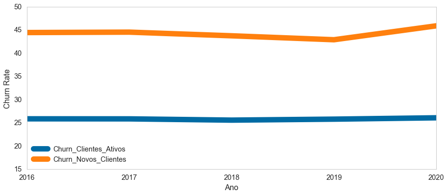

# Teste Técnico - Localiza

## 1º Desafio

O gerenciamento do relacionamento com os clientes tem como um dos seus objetivos centrais **aumentar o número de clientes ativos** da empresa - e a retenção desses clientes é crítica para seu sucesso. Buscando maior compreensão das particularidades do negócio e do cenário do churn, foi realizada uma **análise exploratória dos dados dos contratos** no período de 2015 à 2020. Algumas hipóteses iniciais foram levantadas, visando direcionar a análise. Considerando a base de dados **base_teste** e um **período de churn de 1 ano**, foi realizada a validação da seguinte hipótese: **“O churn de novos clientes é maior do que o churn de clientes ativos”.**

Churn rate, ou taxa de rotatividade, é a medida do número de clientes que deixou de fazer negócios com a empresa (em um período de tempo específico). O cálculo do churn é feito a partir da **divisão** entre o número de clientes que interromperam o serviço no fim do período e o número de clientes no início desse mesmo período. Para a correta validação da hipótese é necessário definir o que foi considerado como **cliente ativo** e como **novo cliente**. 

No contexto dessa análise, foi considerado: 
**Cliente Ativo**: o cliente que realizou alguma contratação no ano anterior ao ano em análise.
**Novo Cliente**: o cliente que não fez nenhum contratação no ano anterior e fez ao menos uma contratação no ano analisado.

Foi considerado como churn, para cada grupo de clientes, o seguinte: 
**Churn de Clientes Ativos**: clientes ativos que não fizeram nenhuma contratação no ano analisado. Caso esse mesmo cliente faça uma contratação em algum ano posterior, será considerado como um Novo Cliente.
**Churn de Novos Clientes**: novos clientes que fizeram apenas uma contratação no ano analisado. Esses clientes aparecerão no cálculo do ano seguinte como clientes ativos, fato que precisa ser melhor discutido com a área de negócio para determinar se faz sentido essa premissa. 

O Gráfico abaixo apresenta o Churn rate de 2016 à 2020, para Clientes Ativos e Novos Clientes: 

Fica bem claro, através da comparação do churn rate nos períodos, que a hispótese de que **"O churn de novos clientes é maior do que o churn de clientes ativos"** é **verdadeira!**

